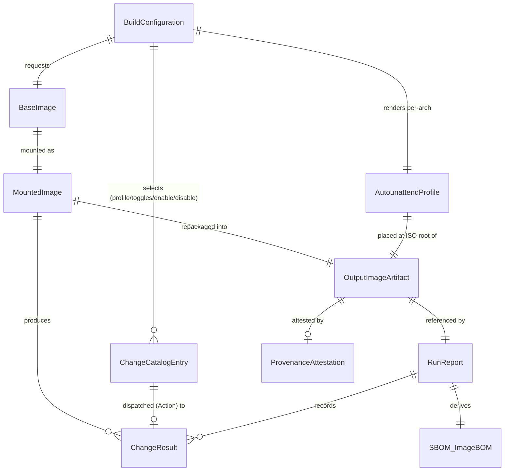
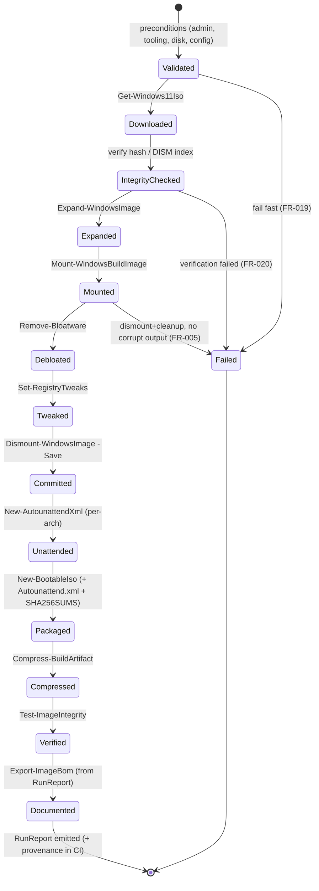

# Phase 1 Data Model: Windows 11 ISO Builder & Debloater

Entities are derived from the spec's Key Entities and realized as PowerShell objects /
config data structures. No relational database — these are in-memory objects and versioned
config files.

---

## Entity: BuildConfiguration

The resolved, validated set of inputs that drives a build. Produced by
`Get-BuildConfiguration` (defaults ← config file ← env ← parameters).

| Field | Type | Validation | Default | Notes |
|-------|------|-----------|---------|-------|
| `Edition` | string | non-empty | `Pro` | Windows 11 edition (FR-002) |
| `Language` | string | non-empty (BCP-47-ish) | `en-US` | Display language |
| `Release` | string | non-empty | `latest` | Resolved by Fido at build time; actual recorded in run report |
| `Architecture` | string | `ValidateSet('amd64','arm64')` | `amd64` | First-class, validated (Principle IV) |
| `Profile` | string | `ValidateSet('minimal','default','aggressive')` | `default` | Named catalog subset (FR-024) |
| `Toggles` | hashtable | keys are catalog Ids | `@{}` | Per-entry `Id -> [bool]` override map (FR-024) |
| `EnableCatalogId` | string[] | ids exist in catalog | `@()` | Force-enable specific entries (opt-in, incl. Edge/OneDrive/WSL) |
| `DisableCatalogId` | string[] | ids exist in catalog | `@()` | Force-disable specific entries |
| `IsoPath` | string? | path exists if set | `$null` | Optional pre-downloaded ISO override |
| `WorkingDirectory` | string | writable path | temp | Scoped work area (Principle VI) |
| `OutputDirectory` | string | writable path | `./out` | Where artifact is written |
| `Autounattend` | hashtable | see AutounattendProfile | (defaults) | Install/OOBE-time settings (FR-027) |
| `AzureUpload` | hashtable? | see below | `$null` | Optional Azure Blob upload config (FR-030) |
| `BootTest` | bool | — | `$false` | Opt-in VM boot validation (FR-023) |
| `WhatIf` | bool | — | `$false` | Dry-run/preview (FR-016) |

**Rules**:
- Change selection is purely data-driven (FR-024): the effective enabled set =
  `Profile` baseline, then `Toggles` (`Id -> bool`), then `EnableCatalogId` / `DisableCatalogId`
  (explicit ids win). There are **no** dedicated `RemoveEdge`/`RemoveOneDrive` parameters — Edge
  and OneDrive removal are ordinary opt-in catalog entries (`DefaultEnabled=false`) enabled via
  `EnableCatalogId`/`Toggles` (FR-008, FR-024). WSL is likewise an opt-in catalog entry.
- `Architecture` selects which arch-scoped catalog entries and boot data apply, and the
  `processorArchitecture` written into the generated `Autounattend.xml` (FR-027).
- `AzureUpload` (when set) carries `{ StorageAccount; Container }`; credentials are supplied via
  OIDC at CI time, never stored in config (FR-030, Principle VII).

---

## Entity: ChangeCatalogEntry

A single documented modification. Stored as data in `config/catalog.*.psd1` (never inline).
This is the heart of Principle II. Schema is enforced by `Catalog.Schema.Tests.ps1` and
`contracts/change-catalog.schema.json`.

| Field | Type | Required | Validation | Notes |
|-------|------|----------|-----------|-------|
| `Id` | string | yes | unique, kebab/pascal | Stable identifier (e.g. `appx-clipchamp`) |
| `Action` | string | yes | `RemoveAppx`\|`RemoveCapability`\|`SetRegistry`\|`EnableOptionalFeature`\|`AddCapability` | **Dispatch key** for `Invoke-CatalogEntry` (extensible) |
| `Type` | string | no | `Appx`\|`Capability`\|`Registry`\|`OptionalFeature` | Optional derived category (authoring/back-compat) |
| `Target` | string/object | yes | non-empty | Package/capability/feature name, or reg key+value object |
| `Description` | string | yes | non-empty | **What** it does (Principle II) |
| `Rationale` | string | yes | non-empty | **Why** it is safe/desirable (Principle II) |
| `Citation` | string | yes* | URL or `Unverified` | **Citation** (Principle II) |
| `EvidenceGrade` | int | yes | `1`\|`2`\|`3` | 1=MS official, 2=reputable vendor, 3=community (FR-026) |
| `Reversible` | bool | yes | — | Reversibility (FR-018) |
| `Reversal` | string? | no | — | How to undo (when reversible) |
| `DefaultEnabled` | bool | yes | — | In default profile? Edge/OneDrive/WSL = `$false` |
| `Arch` | string[] | yes | subset of `amd64,arm64` | Applicable architectures (FR-021/Principle IV) |
| `Editions` | string[]? | no | — | Restrict to editions if applicable |
| `Unverified` | bool | no | default `$false` | If `$true`, `DefaultEnabled` MUST be `$false` |

**Rules** (test-enforced):
1. Every entry MUST have non-empty `Description`, `Rationale`, a `Citation`
   (URL or explicit `Unverified`), an `Action`, and an `EvidenceGrade`. Missing any → CI
   fails (SC-004, SC-010, FR-009, FR-026).
2. **Evidence-grade gate**: an entry with `EvidenceGrade=3` (community/forum) MUST have
   `DefaultEnabled=$false` (opt-in only). Violations fail CI (FR-026, SC-010, Principle II).
3. If `Unverified=$true` (or `Citation='Unverified'`), then `DefaultEnabled` MUST be
   `$false` (opt-in only) — Principle II.
4. `Id` MUST be unique across all catalog files.
5. `Arch` MUST be a non-empty subset of `{amd64, arm64}`.
6. `SetRegistry` `Target` MUST specify hive/path/name/type/value; `RemoveAppx`,
   `RemoveCapability`, `EnableOptionalFeature`, and `AddCapability` `Target` is a name string.
7. New behaviors are added by adding an entry (with the right `Action`), never a new
   parameter/switch/code path (FR-024, SC-011). New `Action` *types* add one dispatcher
   branch in `Invoke-CatalogEntry` and nothing else.

**Registry Target shape** (for `Action=SetRegistry`):

```
Target = @{
    Hive  = 'SOFTWARE' | 'SYSTEM' | 'DEFAULT'   # which loaded offline hive
    Path  = 'Policies\Microsoft\Windows\WindowsAI'
    Name  = 'DisableAIDataAnalysis'
    Kind  = 'DWord' | 'String' | 'ExpandString' | 'QWord' | 'MultiString' | 'Binary'
    Value = 1                                    # for Set; omit for Delete
}
```

**Seed default-profile entries (illustrative; full list in config)**:
- `appx-clipchamp`, `appx-bingnews`, `appx-bingweather`, `appx-solitaire`,
  `appx-xbox-*`, `appx-teams-consumer`, King/Candy-Crush titles (FR-006) —
  `Action=RemoveAppx`, `DefaultEnabled=true`, `EvidenceGrade` 1–2, both arches unless arch-specific.
- `reg-disable-recall` (Recall), `reg-disable-widgets` (Widgets) — `Action=SetRegistry`,
  `DefaultEnabled=true` (FR-007), reversible, `EvidenceGrade=1`.
- `reg-*` privacy/telemetry safe tweaks — `Action=SetRegistry`, `DefaultEnabled=true`,
  reversible, cited.
- `remove-edge`, `remove-onedrive` — `Action=RemoveAppx`/`RemoveCapability`,
  `DefaultEnabled=false`, opt-in via `EnableCatalogId`/`Toggles` (FR-008, FR-024).
- `feature-wsl` — `Action=EnableOptionalFeature`, `Target='Microsoft-Windows-Subsystem-Linux'`
  (plus a companion `feature-vmplatform` for `VirtualMachinePlatform`), `DefaultEnabled=false`,
  opt-in (FR-025). Rationale/Reversal note the WSL kernel + distro install online on first boot.

---

## Entity: BaseImage

The downloaded Windows 11 media plus integrity metadata. Produced by `Get-Windows11Iso`.

| Field | Type | Notes |
|-------|------|-------|
| `Path` | string | Local path to downloaded/ provided `.iso` |
| `Edition` | string | Resolved edition |
| `Language` | string | Resolved language |
| `Release` | string | **Actual** release resolved by Fido (FR-002 recording) |
| `Architecture` | string | amd64/arm64 |
| `Sha256` | string? | Hash if surfaced/computed (FR-020, Principle VII) |
| `SourceUrl` | string? | URL Fido resolved (not a secret) |
| `Verified` | bool | Integrity check result (FR-020) |

**Rules**: `Verified` MUST be `$true` before servicing (FR-020); otherwise build stops.

---

## Entity: MountedImage

Transient state for a mounted `install.wim`/`.esd` index during servicing.

| Field | Type | Notes |
|-------|------|-------|
| `ImagePath` | string | Path to `install.wim`/`.esd` |
| `Index` | int | Image index being serviced (edition-selected) |
| `MountPath` | string | Directory where image is mounted (scoped working dir) |
| `LoadedHives` | hashtable | Mounted offline hive keys (name → temp mount) |
| `IsMounted` | bool | Guard for cleanup/dismount |

**Rules**: All mutations scoped under `MountPath`; hives unloaded and image dismounted in a
`finally` block even on failure (Principle VI; FR-005 no corrupt output).

---

## Entity: OutputImageArtifact

The final, compressed, bootable image for one architecture.

| Field | Type | Notes |
|-------|------|-------|
| `IsoPath` | string | Built bootable `.iso` |
| `ArchivePath` | string | Compressed artifact (`.zip`/`.7z`) |
| `Architecture` | string | amd64/arm64 |
| `Sha256` | string | Hash of the archive (for report/verification) |
| `SizeBytes` | long | Archive size |
| `IntegrityResult` | object | Result of `Test-ImageIntegrity` |
| `RunReportPath` | string | Associated run report |
| `ChecksumManifestPath` | string | `SHA256SUMS` file listing artifact hashes (FR-028) |
| `AutounattendPath` | string | Generated `Autounattend.xml` placed at ISO root (FR-027) |
| `ProvenancePath` | string? | SLSA provenance attestation, when produced in CI (FR-028) |
| `ImageBomPath` | string | CycloneDX + human-readable Image BOM (FR-029) |

---

## Entity: AutounattendProfile

Install/OOBE-time settings rendered per architecture into an `Autounattend.xml` by
`New-AutounattendXml` from a template under `templates/autounattend/`. Complementary to DISM
offline servicing (image-time). Sourced from `BuildConfiguration.Autounattend`.

| Field | Type | Default | Notes |
|-------|------|---------|-------|
| `ProcessorArchitecture` | string | (from `Architecture`) | `amd64` or `arm64` — written into every unattend component (FR-027) |
| `SkipOobe` | bool | `$true` | Skip OOBE privacy/prompt pages |
| `BypassMsAccount` | bool | `$true` | Bypass the Microsoft-account requirement (toggleable) |
| `CreateLocalAccount` | bool | `$true` | Create a local account (default on) |
| `LocalAccountName` | string | `admin` | Local account username (no password stored in repo) |
| `Locale` | string | (from `Language`) | UI/system locale |
| `KeyboardLayout` | string | `0409:00000409` | Input locale |
| `TimeZone` | string | `UTC` | Time zone id |
| `DiskLayout` | string | `default-uefi-gpt` | Named disk-partition layout template |
| `FirstLogonCommands` | string[] | `@()` | Commands run at first logon |
| `SetupCompleteCommands` | string[] | `@()` | Commands run at SetupComplete |

**Rules**:
- One `Autounattend.xml` is generated **per architecture** with the correct
  `processorArchitecture` (FR-027); the file is placed at the ISO root by `New-BootableIso`.
- No password/secret is stored in the repo or logs; a first-boot password-set flow is used
  when required (Principle VII).

---

## Entity: ProvenanceAttestation

The verifiable provenance + integrity metadata for a produced ISO (FR-028, Principle VII).
Produced in CI by the build workflow.

| Field | Type | Notes |
|-------|------|-------|
| `ArtifactPath` | string | The ISO/archive the attestation covers |
| `Sha256` | string | SHA256 recorded in the `SHA256SUMS` manifest |
| `ChecksumManifestPath` | string | `SHA256SUMS` file published alongside artifacts |
| `AttestationRef` | string | SLSA provenance produced by `actions/attest-build-provenance` |
| `Verified` | bool | Result of `gh attestation verify` (consumer-side) |

**Rules**: Every released ISO MUST have a SHA256 entry and a provenance attestation so a
consumer can independently verify authenticity + integrity (SC-009).

---

## Entity: SBOM / ImageBOM

Two bills of materials (FR-029, Principle VII).

| Field | Type | Notes |
|-------|------|-------|
| `RepoSbomPath` | string | Repository/tooling SBOM (CycloneDX), generated by `anchore/sbom-action` in CI |
| `ImageBomPath` | string | Image BOM (CycloneDX + human-readable `.md`) from `Export-ImageBom` |
| `BaseImageVersion` | string | Resolved Windows release/version |
| `BaseImageSha256` | string | Base image hash |
| `ToolVersions` | hashtable | Pinned Fido tag/commit, ADK version, PowerShell/Pester/PSSA |
| `AppliedChanges` | object[] | Every applied change with its `Citation` + `EvidenceGrade` |

**Rules**: The Image BOM is **derived from the RunReport** (not recomputed) and enumerates
100% of the changes actually applied, plus base-image version/hash and pinned tool versions
(FR-029, SC-012). `Export-ImageBom` emits both CycloneDX JSON and a human-readable Markdown.

---

## Entity: RunReport

The auditable record of a single build (FR-022, FR-009 audit trail).

| Field | Type | Notes |
|-------|------|-------|
| `Timestamp` | datetime | Build start (UTC) |
| `ResolvedConfig` | BuildConfiguration | Full resolved config (FR-022) |
| `BaseImage` | BaseImage | With resolved release + hash |
| `Applied` | ChangeResult[] | Entries actually applied |
| `Skipped` | ChangeResult[] | Entries skipped + reason (FR-021) |
| `Artifact` | OutputImageArtifact | Produced artifact reference |
| `Integrity` | object | Structural (and optional boot) validation results |
| `ToolVersions` | hashtable | Fido tag/commit, ADK, Pester, PSSA, PowerShell versions |
| `Autounattend` | AutounattendProfile | Resolved install/OOBE-time settings (FR-027) |
| `Bom` | SBOM/ImageBOM | Image BOM derived from this report (FR-029) |
| `Provenance` | ProvenanceAttestation? | Checksum + attestation refs when built in CI (FR-028) |
| `Outcome` | string | `Succeeded`\|`Failed`\|`Preview` |

### Sub-object: ChangeResult

| Field | Type | Notes |
|-------|------|-------|
| `Id` | string | Catalog entry id |
| `Type` | string | Appx/Capability/Registry |
| `Status` | string | `Applied`\|`AlreadyApplied`\|`NotApplicable`\|`Skipped`\|`Failed` |
| `Reason` | string? | Why skipped/not-applicable (FR-021) |
| `Citation` | string | Carried from catalog (audit) |

**Rules**:
- Preview/dry-run runs (FR-016) produce a RunReport with `Outcome=Preview` and modify no
  media, listing everything a real run *would* do (SC-006).
- Idempotent re-runs mark unchanged entries `AlreadyApplied` (FR-017, SC-007).

---

## Relationships



---

## State transitions (build lifecycle)


